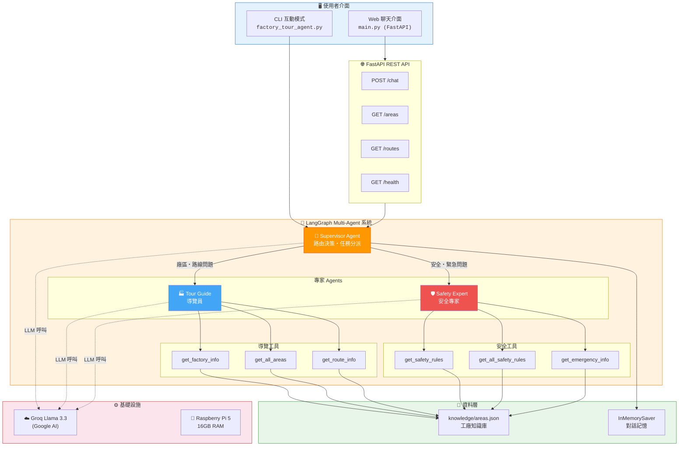
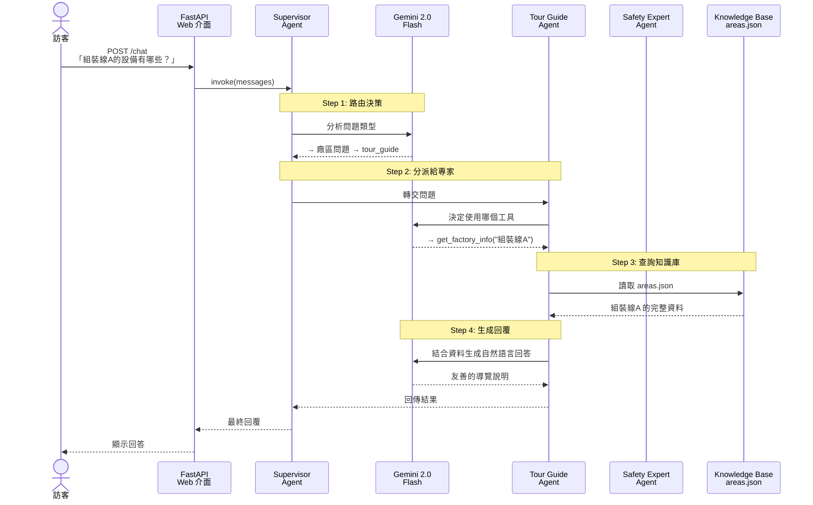
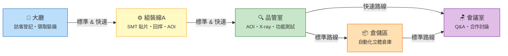

# 工廠導覽 Multi-Agent 系統

基於 LangGraph + Groq (Llama 3.3 70B) 的智慧工廠導覽系統，運行在 Raspberry Pi 5 上。

## 架構總覽

### 系統架構圖



### 專案檔案結構

```
factory-tour/
├── main.py                    # FastAPI Web 伺服器 + 聊天介面
├── factory_tour_agent.py      # Multi-Agent 核心（Supervisor + Agents + Tools）
├── knowledge/
│   └── areas.json             # 工廠知識庫（區域、路線、安全規範、緊急資訊）
├── requirements.txt           # Python 套件依賴
├── .env                       # 環境變數（GOOGLE_API_KEY）
├── .env.example               # 環境變數範本
├── .gitignore
└── README.md
```

### 對話處理流程圖



### 導覽路線地圖



### 角色說明

| Agent | 職責 | 工具 |
|-------|------|------|
| **Supervisor** | 分析訪客問題，路由給對應的專家 Agent | — |
| **Tour Guide** | 廠區介紹、設備說明、導覽路線 | `get_factory_info`, `get_all_areas`, `get_route_info` |
| **Safety Expert** | 安全規範、防護裝備、緊急應變 | `get_safety_rules`, `get_all_safety_rules`, `get_emergency_info` |

## 快速開始

```bash
# 1. 進入專案目錄
cd /home/pi/factory-tour

# 2. 啟用虛擬環境
source /home/pi/factory-tour-env/bin/activate

# 3. 設定 API Key
cp .env.example .env
# 編輯 .env，填入你的 Google Gemini API Key

# 4a. 命令列模式
python factory_tour_agent.py

# 4b. Web API 模式
uvicorn main:app --host 0.0.0.0 --port 8000
# 然後用瀏覽器打開 http://<pi-ip>:8000
```

## API 端點

| 方法 | 路徑 | 說明 |
|------|------|------|
| GET | `/` | Web 聊天介面 |
| POST | `/chat` | 對話 API |
| GET | `/areas` | 廠區列表 |
| GET | `/routes` | 導覽路線 |
| GET | `/health` | 健康檢查 |

## 知識庫

工廠資訊存放在 `knowledge/areas.json`，可自行編輯新增區域。

## 技術棧

- Python 3.13
- LangGraph 1.1 + langgraph-supervisor
- LangChain + Google Groq Llama 3.3
- FastAPI + Uvicorn
- SQLite (對話持久化，選配)
